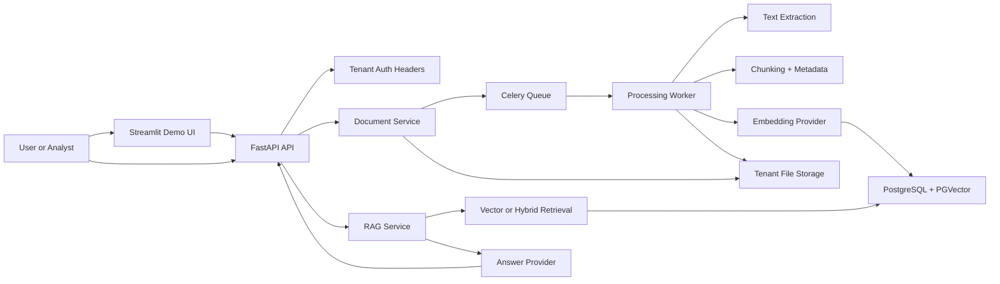

# Enterprise RAG Architecture

## Notes

- Multi-tenant isolation lives in auth dependency, repositories, and retrieval filters.
- Background ingestion keeps upload latency low and makes reprocessing cheap.
- SQLite fallback exists for local tests, but production path is PostgreSQL plus pgvector.
